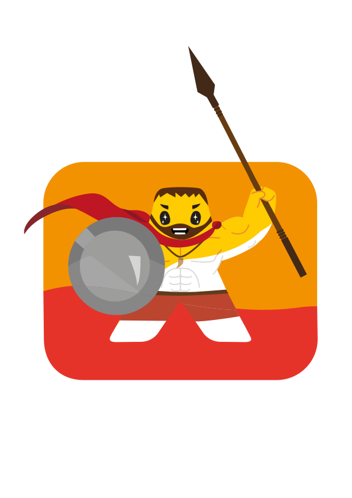
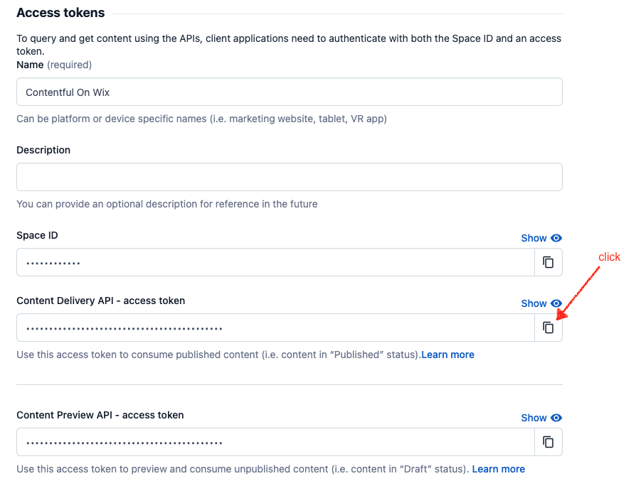
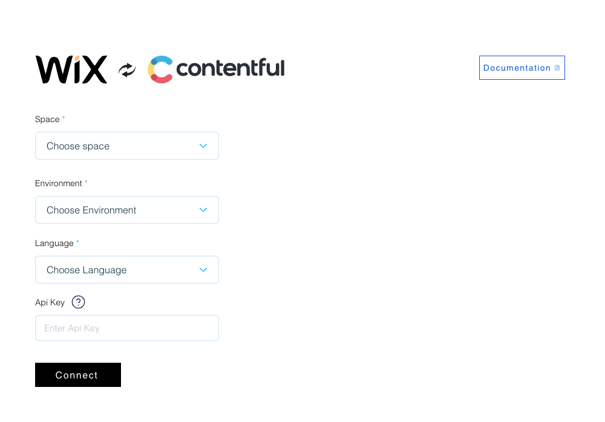
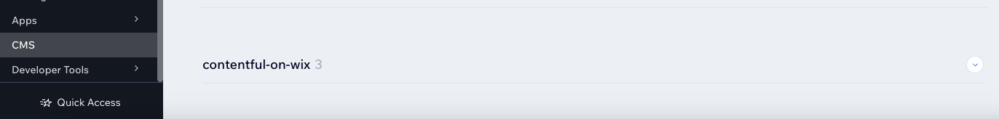
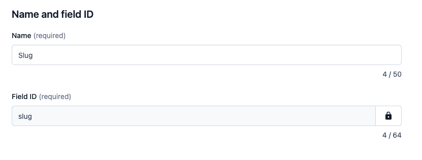
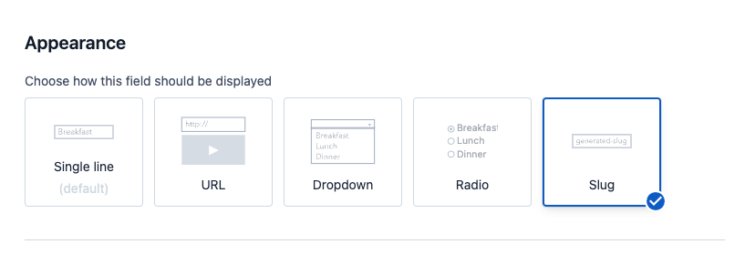
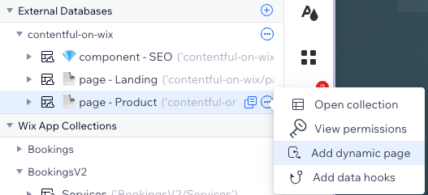
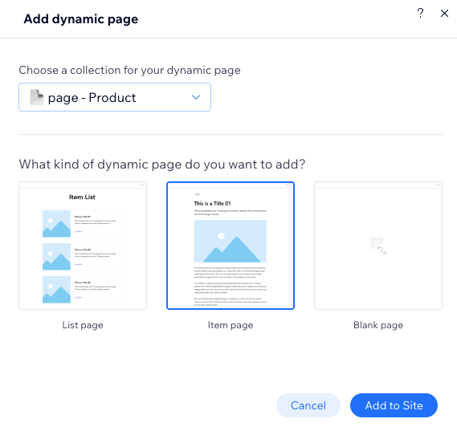
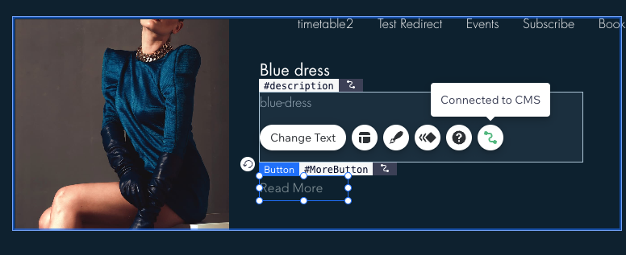
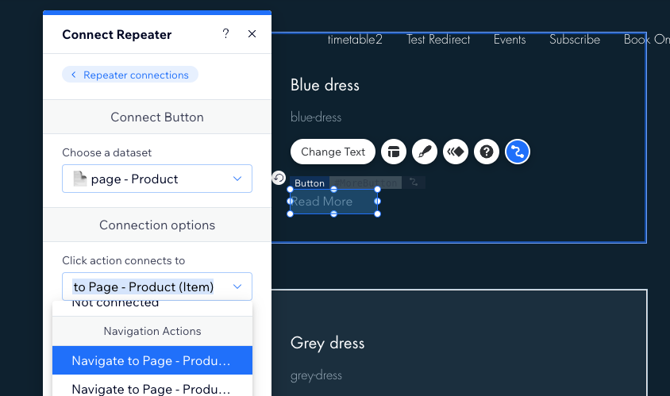

 
## Contentful Integration with Wix
This application facilitates the seamless connection between your Wix site and Contentful account, allowing you to utilize the content created in Contentful to populate your Wix site effortlessly.

## Installation
1. [Enable dev mode](https://dev.wix.com/docs/develop-websites/articles/getting-started/resources/about-velo-by-wix#to-enable-velo-on-your-site) in your Wix site.
2. Install the application and establish the connection between your Contentful account and Wix site:   
   1. Open [Wix App Market](https://www.wix.com/app-market/search-result?query=contentful) and search for "Contentful"
   2. Follow the steps in the wizard to connect your Contentful account to your Wix site.
   3. Select the space, language and environment you want to connect to your Wix site.
   4. Optionally - add a Contentful [API key](https://training.contentful.com/student/page/1050378-creating-and-managing-api-keys) to improve performance and stability.
      - Copy `Content Delivery API - access token` from Contentful 
   
   5. Click "Connect" to complete the connection. 
   
    *Note:* Using [API Key](https://www.contentful.com/blog/api-key/) is not mandatory, but it's recommended for better performance and stability. Check https://www.contentful.com/developers/docs/technical-limits/ for more details.
3. Navigate to the CMS tab in your business manager. Under "External Collections," you will find a new namespace named "contentful-on-wix," housing all your content models and data. 
   

## Using the models in your site (Datasets)
1. Open Wix Editor
2. Add dataset to your page
   1. Open Wix Editor "Add Panel" and click "CMS" followed by the + sign next to "Datasets" 
   
   2. Choose one of the models you have in Contentful
3. Bind fields from your dataset to elements on your page.

## Dynamic Pages
Dynamic pages are a type of web page designed to showcase content from a CMS collection. They enable the creation of websites capable of efficiently managing extensive content while maintaining a consistent design and user experience. 
You can add dynamic pages to your Wix site by following Wix documentation [here](https://support.wix.com/en/article/cms-about-dynamic-pages). 
In order to create dynamic pages in Wix, with the ability to present list of items and a dedicated page for each item, you will need to follow the steps below. 
1. Within your content model, define a Slug field:
   1. create a "Text" field (Symbol), name it `Slug` with the id `slug`. 
      
   2.  Set its appearance to "Slug" in the Appearance section. 
      
   3. Populate the field with a url friendly unique value for each entry (i.e. `"winter-2023-blue-dress"`). 
2. In the Wix editor, you can now add a dynamic page to the collection - list page and item page
   1. Select `Databases` from the left menu in the editor
      -. If you don't see it, make sure [Dev Mode](https://dev.wix.com/docs/develop-websites/articles/getting-started/resources/about-velo-by-wix#to-enable-velo-on-your-site) is enabled in your site.
   2. Select the collection and select the `Add Dynamic page` option from the actions menu. 
   
   3. Add an item page, by selecting the relevant option and clicking `Add to Site` 
   
   4. Repeat steps 2 and 3 for the list page. 
   5. In the list page, click the link/button you would like to link to the item page in any of the items and select Connect with CMS 
   
   6. Select the item page you created in step 3. 
    

## Known Limitations

1. You can connect only one Contentful account to your Wix site. If you require additional connections, please contact us at spartans@wix.com.
2. Currently, only one language is supported at a time. Contentful supports multiple languages. Multilingual support is in our roadmap.
   1. You can choose the language you want to connect to your Wix site during the connection process.
3. Multi-reference fields between different content types are not supported at the moment but are on our roadmap.
4. Embedded entries in rich text fields are not supported. If you need this feature, please contact us.
5. In cases a media field contains mixed types, the field type in Wix will be determined by the type of the first item in the data. It is advisable to separate fields in Contentful based on media type.
6. If a reference field contains mixed types in the data, the field type in Wix will be determined by the type of the first item in the data. It is recommended to segregate fields in Contentful based on reference type.
7. Altering the connection settings in the editor may break the integration. In such cases, you will need to reconnect the site to Contentful.
8. Only published entries will be accessible in Wix; drafts will not be available.
9. It is not possible to add, update, or delete data stored in Contentful using Wix CMS. All data manipulation should be done in Contentful.

## Integrating other CMS providers with Wix CMS
Contentful on Wix server is running on Wix Velo, In order to provide a reference as of how can you create similar integrations with external CMS providers, we have created a reference implementation of a Velo app that connects to Contentful.
The code is available [here](velo-app-code) and the creation of external connections in Wix is described in the [external-connection-api service](velo-app-code/velo-code/backend/services/external-connection-api.js).
